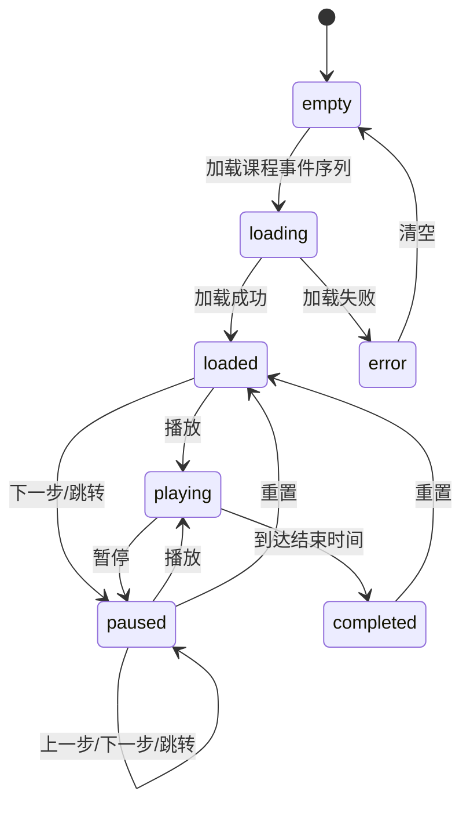

# 调度沙盘与统一运行内核设计

日期：2026-06-14

适用项目：智能充电桩调度管理系统

## 1. 背景与问题

当前系统已经具备车主申请、排队调度、充电计费、故障处理和课程样例运行能力。但如果把老师样例做成独立的“测试用例页面”，演示时会像是在系统之外附加了一张核对表，而不是系统本身具备完整的调度运行能力。

上一版设计提出“后端一次性生成确定性快照，前端只负责播放”。这个边界对前端展示是正确的，但对系统架构仍然不够准确：如果后端的“回放服务”拥有一套独立调度规则，而车主自助和运营管理走另一套服务，那么演示、验收、正常使用仍然是三套弱关联流程。

本版设计的核心修正是：系统应有一个统一的站点运行内核。正常使用、调度沙盘和课程验收都通过同一套业务命令、调度规则、计费规则和状态投影，只是运行上下文不同。

## 2. 核心定位

本功能不是单独做一个“验收播放器”，而是把系统抽象成两种运行模式：

- `实时运行模式`：车主和管理员真实操作系统，命令写入 H2 日常业务数据。
- `沙盘运行模式`：课程事件序列驱动同一套业务规则，在独立内存上下文中运行，用于课堂演示、复盘和结果核对。

课程验收不是第三套业务。验收只是对沙盘运行结果的一组检查和表格投影。

三者关系应明确为：

```text
统一站点运行内核
  ├─ 实时运行模式：车主自助 / 运营管理
  └─ 沙盘运行模式：调度沙盘
        └─ 结果核对：课程验收检查项和表格输出
```

因此，页面可以有“调度沙盘”，结果区域可以有“结果核对”，但系统架构里不应出现一套和正常业务并行发展的“验收业务规则”。

## 3. 目标与非目标

### 3.1 目标

第一版目标：

1. 内置课程事件序列，可一键加载。
2. 使用统一业务规则运行课程事件，而不是在验收服务里另写一套调度逻辑。
3. 沙盘支持播放、暂停、上一步、下一步、重置、倍率和跳转。
4. 沙盘展示等候区、快充区、慢充区、车辆状态、充电桩状态、故障和恢复过程。
5. 正常使用页面和沙盘页面共享同一种站点状态投影，避免展示字段和业务含义各说各话。
6. 结果核对能证明课程样例关键输出没有回退。
7. 沙盘默认不污染车主自助端和运营管理端的日常演示数据。

### 3.2 非目标

第一版不做：

1. 不接入真实充电设备。
2. 不做生产级离散事件仿真平台。
3. 不追求复杂游戏引擎级动效。
4. 不默认把沙盘运行结果写入 H2 日常业务数据。
5. 不把动画效果置于结果正确性之前。
6. 不一次性重写整个后端。现有代码可以分阶段向统一内核收敛。

## 4. 术语

为避免“演示”“验收”“正常使用”混乱，文档采用以下术语：

- `业务命令`：外部输入，例如提交充电申请、取消请求、修改电量、设置故障、恢复充电桩、推进时间。
- `业务事件`：命令执行后产生的事实，例如车辆已入队、车辆已分配到充电桩、充电已完成、账单已生成、充电桩已故障。
- `运行上下文`：保存当前站点状态的环境。实时运行模式使用 H2 持久化上下文，沙盘运行模式使用内存上下文。
- `运行内核`：执行命令、应用调度和计费规则、更新运行上下文的业务核心。
- `站点快照`：某个时刻完整的可展示状态，用于车主端、运营管理端和调度沙盘。
- `回放包`：沙盘运行模式一次运行后返回的事件、快照、转换、检查项和表格行。
- `验收检查`：对回放包中关键行和关键状态的断言，不是独立业务流程。

## 5. 总体架构

推荐架构如下：

```text
                业务命令
                   │
        ┌──────────┴──────────┐
        │                     │
实时输入适配器          课程序列适配器
车主/管理员 API        Excel/内置事件序列
        │                     │
        └──────────┬──────────┘
                   ▼
          ChargingStationRuntime
          统一站点运行内核
                   │
        ┌──────────┴──────────┐
        │                     │
PersistentStationContext  ScenarioRunContext
H2 持久化上下文          内存沙盘上下文
        │                     │
        └──────────┬──────────┘
                   ▼
          StationSnapshotProjector
          统一站点状态投影
                   │
        ┌──────────┴──────────┐
        │                     │
实时页面状态             沙盘回放包
车主/运营管理            快照/转换/核对/表格
```

关键原则：

1. `ChargingStationRuntime` 是业务真相来源。
2. `ScenarioReplayService` 不应自己决定调度规则，它只负责把课程事件序列转换成业务命令，并驱动运行内核。
3. `StationSnapshotProjector` 负责把当前运行上下文转换为统一展示模型。
4. 前端不重新计算调度、计费或故障恢复结果，只消费后端投影。
5. 沙盘可以一次性返回完整回放包，这是交付和播放优化，不是业务规则边界。

## 6. 三种使用关系

### 6.1 正常使用

车主自助和运营管理是系统的真实业务入口。

```text
用户点击按钮
  -> REST API
  -> 业务命令
  -> ChargingStationRuntime
  -> PersistentStationContext
  -> H2 数据更新
  -> StationSnapshotProjector
  -> 返回当前状态
```

正常使用的时间来自系统时钟。每次 API 调用只处理当前命令和当前应发生的业务变化，例如调度、开始充电、结束充电、故障重排和账单生成。

### 6.2 调度沙盘

调度沙盘是课堂讲解入口。

```text
加载课程事件序列
  -> 事件序列适配器
  -> 多个业务命令
  -> ChargingStationRuntime
  -> ScenarioRunContext
  -> 每步生成站点快照和转换摘要
  -> ReplayBundle
  -> 前端播放
```

沙盘使用模拟时钟。它可以快速跑完整个 06:00 到 09:30 的序列，然后把完整快照交给前端播放。这样播放、暂停、倍速和跳转都不会反复改后端状态。

### 6.3 课程验收

课程验收是对沙盘结果的核对方式。

```text
ReplayBundle
  -> AcceptanceCheckProjector
  -> checks / tableRows
  -> 结果核对
```

验收不拥有独立调度逻辑。老师样例表格只是一种输出格式，关键检查项只是一组断言。

## 7. 运行内核设计

建议逐步抽象一个 `ChargingStationRuntime`，统一处理业务命令：

```text
ChargingStationRuntime
  handle(command, context)
  advanceTo(time, context)
  dispatchUntilStable(context)
  snapshot(context)
```

命令类型：

```text
SubmitChargingRequest
CancelChargingRequest
ModifyRequestAmount
ModifyRequestMode
StartCharging
EndCharging
MarkPileFault
RecoverPile
AdvanceClock
```

派生事件：

```text
VehicleQueued
VehicleAssignedToPile
ChargingStarted
ChargingCompleted
BillGenerated
PileFaulted
PileRecovered
VehicleRequeuedByFault
DispatchSkipped
```

第一版不要求所有派生事件都持久化成事件溯源日志，但运行内核应在执行时生成 `RuntimeChange`，供快照转换、检查器说明和测试断言使用。

## 8. 运行上下文

运行上下文提供运行内核需要读写的数据。

### 8.1 PersistentStationContext

用于正常使用：

- 读取和写入现有 JPA Repository。
- 使用 H2 当前业务数据。
- 使用系统真实时间或 `TimeProvider`。
- API 执行后保留状态。

### 8.2 ScenarioRunContext

用于调度沙盘：

- 使用内存对象保存车辆、请求、充电桩、队列、会话和账单。
- 使用模拟时间。
- 不写入 H2。
- 每处理一个课程事件后生成快照。
- 可重复运行，保证同一输入产生同一输出。

两个上下文的数据存储方式不同，但对运行内核暴露的概念一致：车辆、请求、充电桩、队列、会话、账单、配置和当前时间。

## 9. 状态投影

`StationSnapshotProjector` 负责生成统一站点快照。

站点快照应该服务三个界面：

- 调度沙盘：显示完整站点状态和事件回放。
- 车主自助：显示单个车辆状态、排队位置、充电状态和账单摘要。
- 运营管理：显示充电桩状态、队列、故障、统计和运行状态。

基础结构：

```text
StationSnapshot
  time
  waitingArea[]
  fastPiles[]
  tricklePiles[]
  vehicles{}
  activeSessions[]
  bills[]
  stationMetrics
  ruleNotes[]
```

前端各页面可以按需要截取同一个快照模型，而不是各自发明状态字段。

## 10. 回放包数据契约

沙盘 API 返回 `ReplayBundle`：

```json
{
  "scenario": {},
  "commands": [],
  "events": [],
  "snapshots": [],
  "transitions": [],
  "checks": [],
  "tableRows": []
}
```

### 10.1 ScenarioDefinition

```json
{
  "id": "course-sample",
  "name": "课程事件序列",
  "version": "2026-06-14",
  "startTime": "06:00",
  "stopTime": "09:30",
  "pileConfig": {
    "fast": ["F1", "F2"],
    "trickle": ["T1", "T2", "T3"]
  }
}
```

### 10.2 ScenarioCommand

课程事件先被转换成业务命令：

```json
{
  "sequence": 12,
  "time": "07:10",
  "type": "MarkPileFault",
  "targetId": "F1",
  "sourceText": "(B,F1,O,0)",
  "displayText": "F1 快充桩发生故障"
}
```

这样可以明确：Excel 字母语义属于输入适配层，业务核心只处理清晰命令。

### 10.3 StationSnapshot

快照必须是完整状态，而不是差量：

```json
{
  "sequence": 12,
  "time": "07:10",
  "appliedCommandSequence": 12,
  "station": {
    "waitingArea": ["V13", "V14"],
    "fastPiles": [
      {
        "id": "F1",
        "status": "FAULT",
        "currentVehicle": null,
        "queue": [],
        "power": "30.0"
      }
    ],
    "tricklePiles": []
  },
  "vehicles": {
    "V13": {
      "id": "V13",
      "mode": "FAST",
      "state": "WAITING",
      "requestKwh": "110.00",
      "chargedKwh": "0.00",
      "queueNo": "F13",
      "position": "WAITING_AREA"
    }
  },
  "ruleNotes": [
    "故障车辆优先参与重调度"
  ]
}
```

完整快照可以保证上一步、跳转和刷新都不需要反向撤销业务操作。

### 10.4 ScenarioTransition

转换用于解释“从上一个快照到当前快照发生了什么”：

```json
{
  "fromSequence": 11,
  "toSequence": 12,
  "time": "07:10",
  "changes": [
    {
      "entityType": "pile",
      "entityId": "F1",
      "changeType": "STATUS_CHANGED",
      "before": "CHARGING",
      "after": "FAULT",
      "reason": "课程事件：充电桩故障"
    },
    {
      "entityType": "vehicle",
      "entityId": "V5",
      "changeType": "MOVED",
      "before": "F1",
      "after": "WAITING_AREA",
      "reason": "故障重调度"
    }
  ]
}
```

### 10.5 ScenarioCheck

```json
{
  "id": "check-001",
  "name": "07:10 等候区",
  "expected": "(V13,F,110.00)-(V14,F,95.00)",
  "actual": "(V13,F,110.00)-(V14,F,95.00)",
  "passed": true,
  "source": "course-excel"
}
```

`checks` 用于结果核对，`tableRows` 用于兼容原老师样例表格输出。不要为了动画删除或弱化 `tableRows`。

## 11. 数据不变量

后端生成状态时必须保证：

1. 课程命令按 `time + sequence` 稳定排序。
2. `snapshots[0]` 是初始快照。
3. 每个外部课程命令至少对应一个命令后快照。
4. 快照是完整状态，不能依赖前端历史才能还原。
5. 同一时刻多个命令按原始序号处理。
6. 金额使用“分”或固定小数字符串传输，避免前端浮点误差。
7. 电量使用固定小数字符串，例如 `"20.00"`。
8. 沙盘运行不写入日常业务表，除非用户显式执行“应用到当前站点状态”。
9. 正常使用和沙盘运行使用同一调度策略、计费规则和故障处理规则。

## 12. 前端播放模型

前端维护一个模拟时钟，但时钟只决定“当前展示到哪里”，不修改业务状态。

```text
SimulationClock
  startTime
  stopTime
  currentTime
  multiplier
  playing
  tick(realDelta)
```

播放时：

1. 浏览器计时循环推进 `currentTime`。
2. 当 `currentTime` 越过下一个命令时间，播放器切换到对应快照。
3. 事件之间可以插值显示充电进度，但插值仅用于视觉展示。
4. 单步和跳转直接切换快照，不请求后端重新计算。
5. 重置回到初始快照，不影响其它页面状态。

前端“不计算业务结果”不等于沙盘逻辑和正常逻辑割裂。它的含义是：所有页面都信任后端统一运行内核生成的状态投影。

## 13. 播放状态机

第一版建议在 `useSimulationPlayer.js` 中集中维护播放状态：



按钮可用性由状态机决定：

| 状态 | 主按钮 | 允许操作 |
|---|---|---|
| empty | 加载课程事件序列 | 加载 |
| loading | 加载中 | 无 |
| loaded | 播放 | 播放、下一步、重置 |
| playing | 暂停 | 暂停、倍率 |
| paused | 播放 | 播放、上一步、下一步、跳转、重置 |
| completed | 重置 | 查看结果、复制结果、重置 |
| error | 重新加载 | 清空、重新加载 |

不要在多个组件里分别维护 `playing`、`currentIndex`、`currentTime`。

## 14. 页面定位与文案

页面名称建议：

- 顶级入口：`调度沙盘`
- 页面标题：`波普特大学充电站`
- 页面副标题：`调度运行 · 分时计费 · 故障重排`
- 样例按钮：`加载课程事件序列`
- 结果区域：`运行结果`、`结果核对`、`复制结果`

避免把以下文案作为顶级入口或主按钮：

- `测试用例`
- `验收流程`
- `生成演示数据`
- `执行一次调度`
- `Spring Boot + Vue + H2`

这些内容可以保留在 README、关于信息或折叠的运行明细中，但不应成为主界面第一印象。

## 15. 页面布局

第一版采用四区布局。

### 15.1 顶部时钟控制区

展示：

- 当前模拟时间，例如 `07:10`
- 当前序列名称，例如 `课程事件序列`
- 播放 / 暂停
- 上一步 / 下一步
- 重置
- 倍率：`0.5x`、`1x`、`2x`、`5x`、`10x`

### 15.2 中央站点沙盘

展示：

- 等候区：等待车辆卡片，按叫号顺序排列。
- 快充区：F1、F2 两个充电桩。
- 慢充区：T1、T2、T3 三个充电桩。
- 车辆卡片：车辆编号、充电模式、请求电量、已充电量、状态。
- 故障桩：用颜色、图标和文字共同表示，不能只靠颜色。

### 15.3 右侧检查器

展示：

- 当前命令
- 当前车辆详情
- 当前触发规则
- 从上一步到当前步的关键变化

检查器只解释当前命令相关规则，不要把整套调度规则一次性铺满页面。

### 15.4 底部时间轴和结果

展示：

- 全部命令点
- 当前播放位置
- 点击命令点跳转
- 折叠的结果核对
- 复制结果按钮

结果核对默认收起，演示结束后突出显示。

## 16. 前端组件拆分

建议组件结构：

```text
SimulationSandbox.vue
  调度沙盘页面容器

SimulationClockBar.vue
  当前时间、播放控制、倍率

ScenarioLoader.vue
  加载课程事件序列、重置、复制结果入口

StationMap.vue
  等候区、快充区、慢充区整体布局

PileLane.vue
  单个充电桩状态、当前车辆、排队车辆

VehicleToken.vue
  车辆卡片

EventTimeline.vue
  命令轴、命令点、跳转

PlaybackInspector.vue
  当前命令、车辆、规则说明、状态变化

VerificationPanel.vue
  结果核对、tableRows、复制结果

useSimulationPlayer.js
  回放包、状态机、时钟、当前快照、跳转逻辑
```

当前 `AcceptancePanel.vue` 可以拆成两部分：

1. 结果核对和复制表格能力移动到 `VerificationPanel.vue`。
2. 顶级“测试用例”入口替换为 `SimulationSandbox.vue`。

## 17. API 设计

### 17.1 获取当前站点快照

用于正常使用页面：

```text
GET /api/station/snapshot
```

返回当前 H2 业务数据投影出的 `StationSnapshot`。车主端和运营管理端可以逐步迁移到这个统一状态模型。

### 17.2 执行业务命令

现有车主和管理员 API 可以保留，但内部逐步收敛为业务命令：

```text
POST /api/charging/requests
POST /api/charging/requests/{carId}/amount
POST /api/piles/{pileId}/fault
POST /api/piles/{pileId}/recover
```

这些 API 执行后建议返回关键业务结果和最新 `StationSnapshot` 摘要，减少前端刷新不一致。

### 17.3 获取课程样例定义

```text
GET /api/scenarios/course-sample
```

返回：

```json
{
  "scenario": {},
  "commands": [],
  "checks": []
}
```

### 17.4 运行课程样例并生成回放包

```text
POST /api/scenarios/course-sample/run
```

请求体第一版可以为空。后续可扩展：

```json
{
  "includeDebug": false
}
```

返回：

```json
{
  "scenario": {},
  "commands": [],
  "events": [],
  "snapshots": [],
  "transitions": [],
  "checks": [],
  "tableRows": []
}
```

### 17.5 兼容现有验收接口

当前已有验收接口不建议立刻删除。新接口可以先复用旧计算结果，但实现计划中必须安排把旧 `AcceptanceScenarioService` 的核心调度逻辑迁移或收敛到统一运行内核。前端只使用新的回放接口。

## 18. 与现有代码的收敛策略

现有代码大致是两条线：

- 正常业务：`ChargingService`、`SchedulerService`、`FaultService`、`BillingService` 通过 Repository 修改 H2。
- 验收样例：`AcceptanceScenarioService` 内部维护 `ScenarioState` 和自己的调度过程。

直接一次性重写风险较高。建议分阶段收敛：

1. 先定义统一 DTO：`StationSnapshot`、`RuntimeChange`、`ReplayBundle`。
2. 让现有验收服务输出新回放包，避免前端继续绑定旧表格结构。
3. 抽出可共享规则：调度策略选择、计费计算、配置参数、事件解释。
4. 为正常业务增加 `GET /api/station/snapshot`，让实时页面也消费统一状态投影。
5. 再逐步把 `AcceptanceScenarioService.ScenarioState` 替换为 `ScenarioRunContext + ChargingStationRuntime`。

这样第一版就能改善演示体验，同时给真正统一的业务内核留下清晰路线。

## 19. 实现步骤

### 第一阶段：统一状态契约

1. 新增 `StationSnapshot`、`RuntimeChange`、`ReplayBundle` 等 DTO。
2. 现有课程样例运行结果补充 `snapshots` 和 `transitions`。
3. 保留 `tableRows`，确保旧验收输出不回退。
4. 补充后端测试，锁定 36 个课程命令和关键核对项。

### 第二阶段：页面入口

1. 新建 `SimulationSandbox.vue`。
2. 移除顶级“测试用例”入口。
3. 默认入口改为“调度沙盘”。
4. 将原验收表格折叠进“运行结果 / 结果核对”。

### 第三阶段：播放器

1. 新增 `useSimulationPlayer.js`。
2. 实现加载、播放、暂停、上一步、下一步、跳转、重置。
3. 播放时不重复请求后端。
4. 倍率只影响展示速度，不影响业务结果。

### 第四阶段：沙盘可视化

1. 实现等候区。
2. 实现 F1、F2 快充桩。
3. 实现 T1、T2、T3 慢充桩。
4. 实现车辆卡片和故障状态。
5. 根据 `transitions` 展示移动和状态变化说明。

### 第五阶段：实时页面状态统一

1. 增加 `GET /api/station/snapshot`。
2. 车主端和运营管理端逐步用统一快照刷新关键状态。
3. 业务命令执行后主动返回或刷新快照，减少手动刷新造成的错乱。

### 第六阶段：运行内核收敛

1. 抽出 `ChargingStationRuntime`。
2. 抽出 `PersistentStationContext` 和 `ScenarioRunContext`。
3. 将课程样例运行迁移到统一运行内核。
4. 用同一批业务规则测试覆盖实时上下文和沙盘上下文。

### 第七阶段：可选增强

1. 导入外部事件序列。
2. 导出 CSV / Excel 友好文本。
3. 引入 XState 管理更复杂状态。
4. 若 DOM/SVG 动效不足，再评估 PixiJS 或 Canvas。

## 20. 测试策略

### 20.1 后端测试

必须覆盖：

1. 课程命令数量保持稳定。
2. 命令按时间和原始序号稳定排序。
3. 初始快照为空站状态。
4. 车辆申请后进入正确等待区或队列。
5. 充电桩故障后，桩状态和受影响车辆状态正确。
6. 充电桩恢复后重新参与调度。
7. 取消和修改电量命令能正确改变后续结果。
8. 账单金额和充电量格式稳定。
9. 老师样例关键行继续通过。
10. 沙盘运行不写入日常业务数据。
11. 相同配置和相同命令下，实时上下文和沙盘上下文的关键调度结果一致。

### 20.2 前端单元测试

必须覆盖：

1. 加载成功后状态为 `loaded`。
2. 播放后状态为 `playing`。
3. 暂停后当前快照不丢失。
4. 下一步跳到下一个命令并暂停。
5. 上一步回到上一个快照。
6. 跳转命令点后检查器显示对应命令。
7. 重置后回到初始状态。
8. completed 状态下结果核对可展开。

### 20.3 浏览器验收

必须手动验证：

1. 桌面视口下四区布局不重叠。
2. 窄屏下播放控制始终可见。
3. 故障状态不用只靠颜色表达。
4. 倍率切换不会跳乱命令。
5. 反复播放、暂停、单步、重置不出现状态错乱。
6. 切换到车主自助和运营管理后，不需要刷新来修正关键状态。

## 21. 风险与取舍

| 风险 | 影响 | 处理方式 |
|---|---|---|
| 继续扩大独立验收服务 | 正常使用和沙盘结果不一致 | 明确统一运行内核路线，验收只做投影和检查 |
| 一次性重写后端 | 影响稳定性和交付速度 | 先统一 DTO 和投影，再逐步抽运行内核 |
| 前端重复计算业务 | 与后端结果不一致 | 前端只消费快照、转换和检查项 |
| 沙盘污染业务数据 | 多入口状态混乱 | 使用独立内存上下文，默认不写 H2 |
| 金额和电量浮点误差 | 核对结果不稳定 | 后端使用固定格式输出 |
| 结果核对喧宾夺主 | 页面又变回测试页 | 默认折叠，演示结束后突出显示 |

## 22. 验收标准

功能完成后，演示流程应满足：

1. 打开系统后默认看到“调度沙盘”。
2. 点击“加载课程事件序列”，显示 06:00 到 09:30 的命令轴。
3. 点击播放，车辆按时间进入等候区和充电桩。
4. 暂停在故障事件，可以清楚看到故障桩、受影响车辆和重调度说明。
5. 单步前进和后退不会造成状态错乱。
6. 倍率调整只改变播放速度，不改变结果。
7. 播放结束后，结果核对显示关键项通过。
8. 可以复制原有表格结果。
9. 切换到车主自助和运营管理后，普通业务操作仍然保留。
10. 主页面不再出现“测试用例”“验收流程”“生成演示数据”“执行一次调度”等破坏业务真实感的主文案。
11. 文档和代码说明清楚：沙盘、验收、正常使用共享业务规则，区别只在运行上下文和状态投影。

## 23. 最小落地原则

第一版不要追求“像游戏一样炫”。优先级应该是：

```text
业务规则统一 > 结果正确 > 快照稳定 > 状态可解释 > 操作顺滑 > 动效好看
```

沙盘可以一次性返回完整回放包，但这只是播放优化。真正的设计边界是统一运行内核：同一套调度和计费规则既服务真实业务，也服务课程事件复盘和结果核对。
