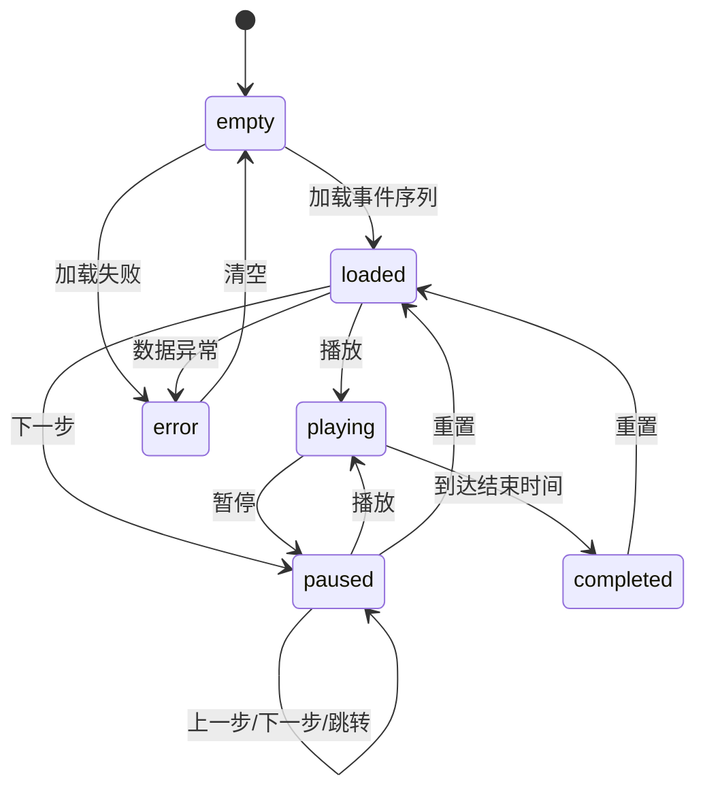

# 调度沙盘回放系统设计

日期：2026-06-14

## 目标

当前系统已经能完成车主申请、排队调度、充电计费、故障处理和老师验收样例运行。但“测试用例”作为独立页面会让演示显得割裂，像是在程序外部附加了一张核对表，而不是系统本身具备调度运行能力。

本设计把验收样例升级为“调度沙盘回放”能力：系统可以加载一组带时间的事件序列，用模拟时钟驱动充电站运行，支持播放、暂停、倍速、单步、跳转和结果核对。老师给的 Excel 样例作为内置事件序列之一出现，演示时不再强调“验收页”或“测试页”，而是展示系统能按业务规则复盘完整的一天运营片段。

第一版目标是课堂演示可靠、操作逻辑自然、结果可核对。它不是生产级仿真平台，也不要求真实设备通信。

## 调研参考

本设计借鉴以下成熟系统和库的做法，但不照搬其技术栈：

- [SimPy](https://simpy.readthedocs.io/)：离散事件仿真以“事件推进时间”，适合充电请求、故障、恢复、完成充电这类离散变化。
- [Cesium Clock](https://cesium.com/learn/cesiumjs/ref-doc/Clock.html)：时钟对象包含当前时间、开始时间、结束时间、倍率和是否播放等核心概念。
- [vis-timeline](https://visjs.github.io/vis-timeline/docs/timeline/)：交互式时间轴适合展示事件点、时间范围、缩放和拖动定位。
- [XState](https://stately.ai/docs/xstate)：播放、暂停、加载、完成、错误等状态适合用显式状态机描述。
- [PixiJS](https://pixijs.com/)：适合高性能 2D 可视化和游戏式渲染，但本系统第一版规模较小，先不作为必选依赖。
- [VueUse useIntervalFn](https://vueuse.org/shared/useintervalfn/)：可作为 Vue 中控制计时器暂停和恢复的轻量工具参考。

## 产品定位

页面名称建议为“调度沙盘”或“运行沙盘”，放在当前系统第一屏或“调度控制台”内。它不是单独的“测试用例”模块，而是运营管理人员观察调度规则如何生效的主演示区。

建议文案：

- 顶栏主标题：`波普特大学充电站`
- 副标题：`调度运行 · 分时计费 · 故障重排`
- 主入口：`调度沙盘`
- 样例入口：`加载课程事件序列`
- 播放按钮：`播放` / `暂停`
- 调度按钮：不再出现独立的“执行一次调度”。调度结果由事件序列和模拟时钟自然推进。
- 结果区域：`运行结果`、`结果核对`、`复制结果`

避免使用的文案：

- `验收流程`
- `测试用例` 作为顶级页面名称
- `生成演示数据`
- `执行一次调度`
- `Spring Boot + Vue + H2` 出现在页面顶栏

技术栈可以放到 README 或关于信息里，页面上只显示用户能理解的业务状态。

## 核心体验

打开系统后，用户看到的是一个正在等待加载事件序列的充电站沙盘。点击“加载课程事件序列”后，系统生成一条从 06:00 到 09:30 的事件时间线，车辆、充电桩和等候区进入初始状态。

用户点击“播放”，模拟时钟开始前进。车辆按事件时间进入等候区，被调度到快充桩或慢充桩；故障事件发生时，对应充电桩状态变红，受影响车辆重新排队；恢复事件发生后，充电桩回到可服务状态。用户可以随时暂停、单步前进、后退到上一个事件、调整倍率或拖动时间轴跳转。

页面底部或右侧持续显示当前事件、当前车辆状态和结果核对。演示完成后，系统显示全部事件已运行，并给出老师样例关键行的匹配结果。

## 页面布局

第一版采用四区布局：

1. 顶部时钟控制区
   - 当前模拟时间，例如 `07:10`
   - 播放、暂停、上一步、下一步、重置
   - 倍率选择：`0.5x`、`1x`、`2x`、`5x`、`10x`
   - 当前序列名称，例如 `课程事件序列`

2. 中央站点沙盘
   - 等候区：显示等待车辆卡片，按叫号顺序排列。
   - 快充区：显示 F1、F2 两个充电桩，每个桩显示队列、当前充电车辆、进度和费用。
   - 慢充区：显示 T1、T2、T3 三个充电桩。
   - 车辆卡片：显示车辆编号、充电模式、请求电量、已充电量。
   - 故障桩：使用明显但不过度刺眼的故障状态。

3. 右侧检查器
   - 当前事件：事件时间、事件类型、事件参数。
   - 当前车辆：车辆位置、状态、剩余电量、所属队列。
   - 规则说明：只展示当前事件触发的规则，例如“故障车辆优先重调度”。

4. 底部时间轴和结果
   - 时间轴显示所有事件点。
   - 用户可点击事件点跳转。
   - 结果核对折叠在底部，不长期占据主视觉。
   - 需要提交或复查时可以展开“复制结果”。

桌面端优先保证一屏能看到时钟、沙盘和当前事件；小屏幕可以把检查器移动到底部，但播放控制必须始终可见。

## 交互模型

系统不再依赖“生成数据”和“执行调度”两个割裂动作。用户操作应接近真实回放软件：

1. `加载课程事件序列`
   - 清空当前运行状态。
   - 加载老师给定的全部事件。
   - 时钟停在 06:00。
   - 沙盘显示初始空站状态。

2. `播放`
   - 时钟按倍率推进。
   - 到达下一个事件时，应用该事件并生成新快照。
   - 事件之间可根据时间差显示充电进度变化。

3. `暂停`
   - 保留当前时间和当前沙盘状态。
   - 允许查看事件、车辆和队列详情。

4. `下一步`
   - 从当前时间跳到下一个事件时间。
   - 应用事件后暂停。
   - 适合课堂讲解每一步调度。

5. `上一步`
   - 回到上一个事件后的快照。
   - 第一版可以通过历史快照实现，不需要反向撤销业务操作。

6. `拖动时间轴`
   - 跳转到最接近的事件快照。
   - 若拖到两个事件之间，显示该区间内的充电进度插值，但业务状态以最近一次事件快照为基础。

7. `重置`
   - 回到当前事件序列初始状态。
   - 不删除内置课程序列。

## 时钟模型

前端维护一个模拟时钟对象，概念上包含：

```text
SimulationClock
  startTime: 06:00
  stopTime: 09:30
  currentTime: 当前模拟时间
  multiplier: 播放倍率
  playing: 是否播放
  tick(realDelta): 根据真实时间差推进模拟时间
```

时钟只负责“现在播到哪里了”，不直接修改业务数据。业务数据由后端生成的事件快照和转换结果决定。

播放时，前端使用浏览器计时循环推进 `currentTime`。当 `currentTime` 越过某个事件时间点时，播放器切换到该事件对应的快照。这样可以保证暂停、倍速和跳转都只影响展示，不改变后端计算结果。

## 后端数据模型

现有 `AcceptanceScenarioService` 已经能按老师事件序列生成结果。下一步应把它从“表格运行器”提升为“回放数据生成器”。

建议结构：

```text
ScenarioDefinition
  id
  name
  startTime
  stopTime
  events[]
  checks[]

ScenarioEvent
  sequence
  time
  source
  target
  action
  value
  displayText

ScenarioSnapshot
  sequence
  time
  waitingArea[]
  fastPiles[]
  tricklePiles[]
  completedVehicles[]
  activeBills[]
  eventResult

ScenarioTransition
  fromSequence
  toSequence
  movedVehicles[]
  changedPiles[]
  completedSessions[]
  billingDeltas[]

ScenarioCheck
  name
  expected
  actual
  passed
```

后端职责：

- 解析内置课程事件序列。
- 按业务规则生成每个事件后的确定性快照。
- 生成事件之间的转换摘要，供前端显示移动和变化。
- 输出结果核对项。
- 保持普通车主端和运营管理端接口不被回放逻辑污染。

后端不负责播放动画，也不按真实时间等待。它一次性返回完整回放数据，前端负责播放。

## 前端组件设计

建议新增或重构为以下组件：

```text
SimulationSandbox.vue
  页面容器，替代当前独立测试用例入口

SimulationClockBar.vue
  显示当前时间、播放控制和倍率

ScenarioLoader.vue
  加载课程事件序列、重置、复制结果

StationMap.vue
  显示等候区、快充区、慢充区和车辆位置

PileLane.vue
  单个充电桩队列和状态

VehicleToken.vue
  车辆卡片，显示编号、模式、电量和状态

EventTimeline.vue
  时间轴、事件点、拖动跳转

PlaybackInspector.vue
  当前事件、车辆和规则解释

VerificationPanel.vue
  结果核对和导出

useSimulationPlayer.js
  统一管理 loaded / playing / paused / completed / error 状态
```

当前 `AcceptancePanel.vue` 可以被拆解：保留结果核对和表格复制能力，但不再作为顶级页面。当前 `App.vue` 中的顶级标签建议调整为：

- `调度沙盘`
- `车主自助`
- `运营管理`

如果需要保留技术演示入口，可以在“调度沙盘”的右下角或折叠区提供“查看运行明细”，而不是顶层暴露“测试用例”。

## 播放状态机

播放器状态应显式建模，避免按钮可点但行为不清楚：



第一版可以手写一个简单组合式函数实现状态机；如果后续播放状态继续复杂化，再引入 XState。不要在多个组件里分散维护 `playing`、`currentIndex` 和 `currentTime`，否则刷新和跳转很容易出现状态不一致。

## 视觉与动效原则

视觉上应该像一个可操作的运营沙盘，而不是游戏页面或营销页面。

- 使用中性色背景和清晰分区，避免大面积炫彩渐变。
- 车辆移动可以使用 CSS transition，不必第一版就引入 Canvas。
- 充电进度用进度条、环形进度或细条均可，但同一页面保持一种风格。
- 故障状态用颜色、图标和文案组合表示，不能只靠颜色。
- 事件时间轴强调可读性，不要用过密的标签挤满底部。
- 按钮只保留当前状态下有意义的动作。例如未加载序列时只显示加载；播放时主按钮变为暂停。

第一版推荐用 Vue + CSS/SVG 完成站点沙盘。PixiJS 更适合大量车辆、粒子动效或复杂路径动画，本系统只有十几辆车和五个充电桩，先使用 DOM/SVG 更容易调试、测试和写课程文档。

## API 设计

建议新增回放语义接口，同时兼容现有验收接口。

```text
GET /api/scenarios/course-sample
  返回课程内置事件序列的定义、事件、检查项说明。

POST /api/scenarios/course-sample/run
  返回完整 snapshots、transitions、checks 和 tableRows。
```

响应应包含：

```text
scenario
events[]
snapshots[]
transitions[]
checks[]
tableRows[]
```

`tableRows` 用于保留当前老师样例表格核对能力；`snapshots` 和 `transitions` 用于沙盘播放。这样不会为了动画牺牲验收输出，也不会让验收表格主导页面设计。

## 与现有系统的关系

调度沙盘不是车主端真实操作流的替代品。三类入口关系如下：

- `调度沙盘`：面向课堂讲解和验收复盘，使用内置事件序列，一次性生成完整回放。
- `车主自助`：面向单个车主操作，展示注册、申请、修改、开始、结束和账单。
- `运营管理`：面向管理员操作，展示参数、充电桩、故障和统计。

沙盘使用独立的内存模型，不直接写入 H2 日常演示数据。这样“加载课程事件序列”不会污染车主端和运营管理端当前状态，也不会产生清空数据后各端显示不同步的问题。

如果后续希望把沙盘结果同步到 H2，应作为单独的“应用到当前站点状态”功能，并显示明确确认，不作为第一版默认行为。

## 分阶段实现

第一阶段：数据结构重构

- 在后端保留现有老师样例计算。
- 增加 `snapshots`、`transitions` 和更明确的 `scenario` 元数据。
- 补充服务层测试，保证现有 36 个事件和关键核对项不回退。

第二阶段：页面入口整合

- 移除顶级“测试用例”标签。
- 新建“调度沙盘”主页面。
- 把课程样例作为“加载课程事件序列”动作。
- 保留结果表格，但默认折叠为运行明细。

第三阶段：播放器

- 实现模拟时钟、播放、暂停、单步、重置和倍率。
- 前端播放器基于快照切换，不实时请求后端。
- 为播放状态写单元测试。

第四阶段：沙盘可视化

- 实现等候区、快充区、慢充区和车辆卡片。
- 按事件转换显示车辆移动、故障和恢复。
- 确保桌面和窄屏下文字不溢出、不遮挡。

第五阶段：时间轴和结果核对

- 接入时间轴组件或轻量自研时间轴。
- 支持点击事件跳转。
- 结果核对默认收起，演示结束后突出显示。
- 增加复制结果功能。

第六阶段：可选增强

- 导入外部事件序列文件。
- 导出 CSV 或 Excel 友好文本。
- 引入 XState 管理复杂播放状态。
- 如果 DOM/SVG 动效不足，再评估 PixiJS。

## 测试策略

后端测试：

- 内置课程序列事件数量保持 36。
- 每个事件时间严格递增或按原始序号稳定排序。
- 快充桩、慢充桩、等候区容量符合需求。
- 故障、恢复、取消、修改电量事件能生成正确快照。
- 现有老师样例关键行继续通过。

前端单元测试：

- 加载事件序列后状态为 `loaded`，当前时间为开始时间。
- 播放时根据倍率推进时间。
- 下一步跳到下一个事件并暂停。
- 上一步回到上一个快照。
- 重置后回到初始快照。
- 结果核对能显示通过和失败。

浏览器验证：

- 桌面视口下，时钟、沙盘、检查器和时间轴不重叠。
- 窄屏视口下，播放控制仍可见，文字不溢出按钮。
- 播放、暂停、单步、倍率、跳转都能操作。
- 加载课程序列后，不需要手动刷新其它端来修正显示。

## 风险与取舍

1. 动画过重会影响稳定性。第一版优先保证快照和结果准确，动效只用于辅助讲解。
2. 老师样例事件含义仍有反推成分。新结构把事件解释集中在后端，后续改规则时不需要重写前端。
3. 时间轴库会增加前端依赖。若只需要点击事件点，先自研轻量时间轴；若需要缩放、拖动和范围选择，再引入 `vis-timeline`。
4. 沙盘和日常演示数据隔离会让两个入口状态不完全一致。这个取舍是有意的，能避免课程样例污染车主端实际操作流。

## 验收标准

完成后，课堂演示应能按以下流程顺畅进行：

1. 打开系统，默认进入“调度沙盘”。
2. 点击“加载课程事件序列”，看到 06:00 到 09:30 的事件时间轴。
3. 点击“播放”，车辆按事件进入等候区和充电桩。
4. 暂停在故障事件，说明受影响车辆如何重新调度。
5. 调整倍率继续播放到结束。
6. 展开“结果核对”，展示关键行通过。
7. 切到“车主自助”和“运营管理”，说明普通业务操作仍然保留。

这个流程中不应出现“验收”“测试用例”“生成演示数据”“执行一次调度”等会破坏业务真实感的主按钮或顶级导航文案。
